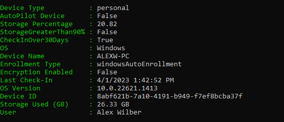

# M365_Security
Repository for hosting security related PowerShell scripts.

## Authenticating

Leverage the GetAccessToken.ps1 script to acquire an access token.

Follow my guide if you are unfamiliar with the Secure Application Model Process: https://tminus365.com/how-to-leverage-microsoft-apis-for-automation/

## API Permissions (Delegated)

Get-DisabledUsers
- AuditLog.Read.All,Directory.Read.All

Get-IntuneDevices
- DeviceManagementServiceConfig.Read.All, DeviceManagementManagedDevices.Read.All

Get-DataProtectionSettings
-SharePointTenantSettings.Read.All

Get-CAPExcludedUsers
-Directory.Read.All,Policy.Read.All,GroupMember.ReadWrite.All

## Instructions 

**Get-IntuneDevices**
- Run the script 
- Provide your Secure Application Model secrets to get an AccessToken
- Provide your Desired File Path for Output
- The Script will provide a CSV of all Intune Devices

<kbd></kbd>

**Get-DataProtectionSettings**
-This Script collects SharePoint Settings, DLP Policies, Retention Policies, Information Protection Labels, and Label Policies
-Review the prerequisite of setting up the Secure Application Model prior to running the script to get the secrets you will need to acquire an access token. 
- Run the script 
- Provide a UPN of a Global Admin that can connect to Security and Compliance PowerShell ex: admin@novacoastschool.com (no quotes)
- Provide your Secure Application Model secrets to get an AccessToken
- The Script will provide a JSON of all policy information in the Temp folder of you C Drive

**Get-CAPExcludedUsers**
-This script records all users being excluded from each conditional acccess policy in a tenant. This includes direct exclusions or exclusions as part of a group. This script should help you identify any misconfigurations in policies. Genernally, you should not have licensed users excluded in your policy definition. 
- CD into the file path you want to have the CSV file output
- Use the GetAccessToken.ps1 script to get an AccessToken for the script. 
- Provide your Secure Application Model secrets to get an AccessToken
- Run the script 
- The Script will output a CSV file in the location you navigate to